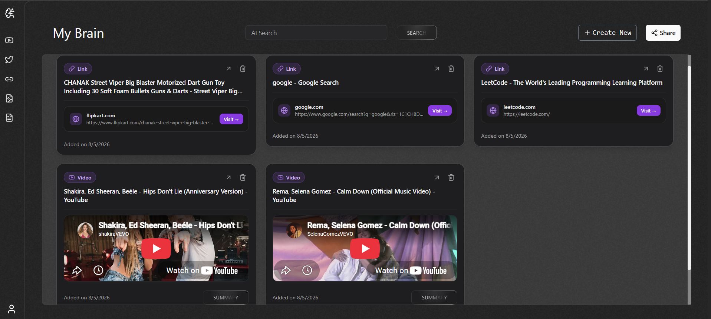
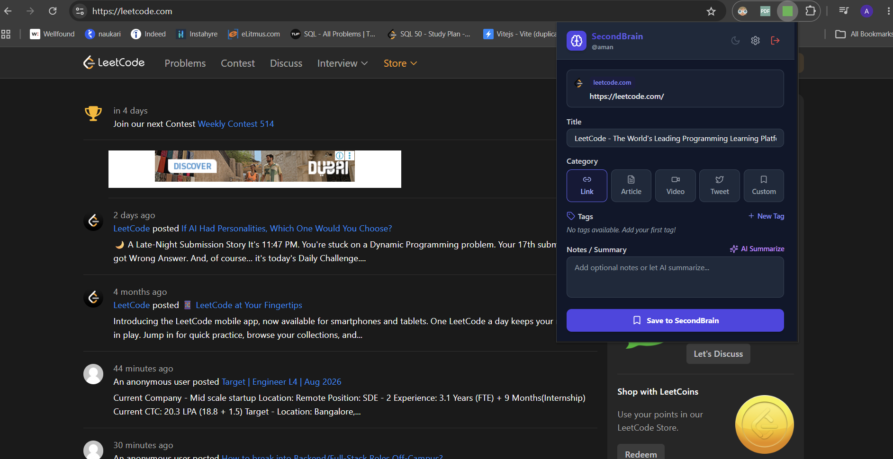
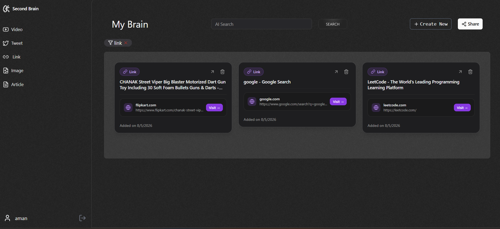
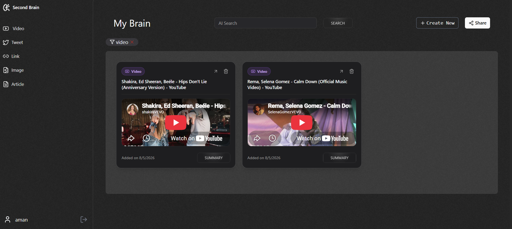
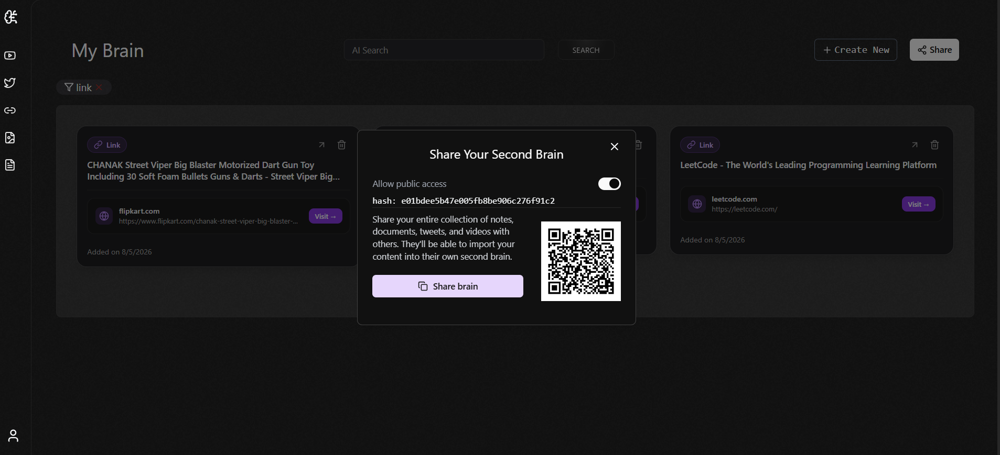
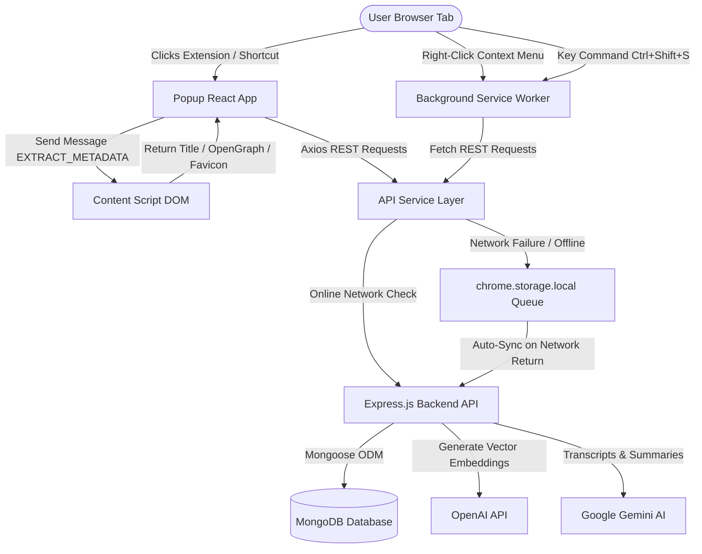

# 🧠 SecondBrain V3 & Chrome Extension (Manifest V3)

[](https://developer.chrome.com/docs/extensions/mv3/intro/)
[](https://react.dev/)
[](https://www.typescriptlang.org/)
[](https://tailwindcss.com/)
[](https://expressjs.com/)
[](https://www.mongodb.com/)
[](https://opensource.org/licenses/ISC)

> **SecondBrain V3** is an enterprise-grade knowledge management platform and **Manifest V3 Chrome Extension**. It enables users to capture, organize, summarize, share publicly, and semantically search web links, articles, YouTube videos, and tweets seamlessly from their browser into a personal digital knowledge base.


*Figure 1: SecondBrain V3 Web Application Dashboard featuring a clean dark mode UI, sidebar navigation, and AI vector search bar.*

---

## 🎯 Executive Overview

### The Problem
Modern internet users consume hundreds of articles, research papers, YouTube videos, and tweets daily. Knowledge is fragmented across browser bookmarks, reading lists, chat threads, and physical notes. Existing tools require manual copy-pasting, lack intelligent duplicate detection, fail when internet connection drops, and do not offer AI-assisted summarization, public knowledge sharing, or vector similarity search.

### The Solution
**SecondBrain V3** solves knowledge fragmentation by pairing a responsive React Web Application with a Manifest V3 Chrome Extension. Users can capture any tab with a single click or keyboard shortcut (`Ctrl+Shift+S`). The system automatically extracts OpenGraph metadata, checks for duplicates, queues items offline when network connection is unavailable, enables public brain sharing via cryptographically secure hash URLs, and synchronizes with a central Express/MongoDB backend equipped with OpenAI embeddings and Google Gemini summarization.

---

## 🎥 Project Demo

[Watch the Project Demo](https://drive.google.com/file/d/1rJVoUFjZLPtvjAFyxCb_Ry4s3SrEAeiT/view?usp=sharing)

## 📦 Download Chrome Extension

You can download and install the **SecondBrain Chrome Extension** using either of the following two options:

1. **Pre-built Extension ZIP (Recommended)**: Download the latest pre-built `secondbrain-extension.zip` directly from [GitHub Releases](https://github.com/amangupta20044/SecondBrain-V3-main/releases).
2. **Build from Source Code**: Clone this repository and compile the extension locally using Node.js and Vite.

> ℹ️ **Note for End Users**:
> - The Chrome Extension connects directly out-of-the-box to the deployed production cloud backend (`https://secondbrain-v3-main.onrender.com`).
> - You do **NOT** need to run a local backend server.
> - You do **NOT** need Node.js installed if you download the pre-built extension ZIP.
> - You do **NOT** need to clone the full repository if you download the pre-built extension ZIP.

---

## 🧩 Install the Chrome Extension (Developer Mode)

Follow these step-by-step instructions to manually load the extension into Google Chrome:

> [!IMPORTANT]
> If you are building from the source code instead of using the pre-built ZIP release, you must build the extension bundle first:
> ```bash
> cd frontend/chrome-extension
> npm install
> npm run build
> ```
> This creates the compiled extension files inside `frontend/chrome-extension/dist/`.

### Installation Steps:

1. **Download the Extension**: Download `secondbrain-extension.zip` from GitHub Releases or build the extension from source code.
2. **Extract the ZIP**: Unzip the downloaded file into a folder on your computer (e.g. `secondbrain-extension/`).
3. **Open Google Chrome**: Launch Chrome on your computer.
4. **Open Extensions Page**: Navigate to the extensions manager by typing this URL into your address bar:
   ```text
   chrome://extensions
   ```
5. **Enable Developer Mode**: Turn **ON** the **Developer mode** toggle switch in the top-right corner of the Extensions page.
6. **Click "Load unpacked"**: Click the **Load unpacked** button located in the top-left corner of the page.
7. **Select the Extension Folder**: Browse to and select the extracted `dist` (or `secondbrain-extension`) folder.
8. **Pin to Toolbar**: Click the **Puzzle icon 🧩** in the Chrome toolbar and pin **SecondBrain** for easy access.
9. **Open Extension**: Click the **SecondBrain** extension icon in your browser toolbar.
10. **Sign In or Sign Up**: Log in with your account (or create a new account) to start saving web pages, YouTube videos, and tweets instantly!

---

## 🖼️ Application Showcase

| Extension Popup Capture | Multi-Category Knowledge Grid |
| :---: | :---: |
|  |  |
| *One-click tab saver with metadata pre-filling & category picker* | *Responsive 3-column grid displaying links, tags, and domain badges* |

| YouTube AI Summarization | Public Brain Share Feature |
| :---: | :---: |
|  |  |
| *Embedded YouTube video player cards & AI transcript summarizer* | *Public shareable page displaying user's curated brain collection via hash link* |

---

## ✨ Features & Functionality

### 1. User Authentication
- **Purpose**: Authenticate users securely and preserve active session states.
- **Workflow**: User submits credentials via the Popup UI or Web App. The system calls `POST /api/v1/user/signin`, receives a JWT token, and stores it securely.
- **UX**: Smooth login/signup forms, inline validation, and automatic session restoration upon extension open.
- **Technical Implementation**: Handled in `AuthService` (`src/services/auth.ts`) and `useAuth` hook. Token is injected via Axios interceptors into all API calls.

### 2. Save Current Web Page
- **Purpose**: Capture active browser tab details without manual copy-pasting.
- **Workflow**: Opening the extension queries `chrome.tabs.query({ active: true, currentWindow: true })` and triggers content script metadata extraction.


*Figure 2: Extension Popup capturing current page title, URL, category, tags, and optional notes.*

- **UX**: Shows a card preview displaying favicon, hostname, URL, pre-filled title, category picker, tag selector, and notes.
- **Technical Implementation**: Implemented in `SaveTabForm.tsx` and `useCurrentTab.ts`.

### 3. Public Knowledge Base Sharing (Hash Link Generation)
- **Purpose**: Publish and share your SecondBrain knowledge base publicly with team members, friends, or the internet via a unique, secure URL.
- **Workflow**:
  1. User toggles **"Share Brain"** in the web dashboard.
  2. The backend route `POST /api/v1/brain/share` receives `{ share: true }`, generates a cryptographically secure 16-byte random hex hash using Node.js `crypto.randomBytes(16).toString("hex")`, and stores the mapping in `LinkModel`.
  3. A shareable link (`/share/:hash`) is generated and copied to the clipboard.
  4. Anyone opening the shared link accesses `SharePage.tsx` (`GET /api/v1/brain/share/:hash`), which retrieves the user's public knowledge collection read-only without requiring login.
  5. Toggling "Share Brain" off sends `{ share: false }`, which deletes the hash entry from `LinkModel` and instantly revokes public link access.


*Figure 3: Public read-only Share Page displaying the user's shared SecondBrain collection.*

- **UX**: One-click toggle switch, instant share link generation, copy to clipboard, and public read-only page with creator attribution.
- **Technical Implementation**: `backend/src/routes/brain.ts`, `LinkModel` database schema, `SharePage.tsx`, and `crypto` library.

### 4. Automated Metadata Extraction
- **Purpose**: Extract high-fidelity metadata (OpenGraph tags, title, favicon, images).
- **Workflow**: The extension sends a runtime message `EXTRACT_METADATA` to `contentScript.ts`. The content script parses DOM meta tags (`og:title`, `og:description`, `og:image`, `og:type`, `twitter:title`, favicon links) and returns them to the popup.
- **UX**: Instant pre-filling of page title, description, and website hostname.
- **Technical Implementation**: `metadataExtractor.ts` running inside DOM context via `contentScript.ts`.

### 5. AI-Powered Summarization
- **Purpose**: Generate instant summaries of YouTube videos and long articles.
- **Workflow**: User clicks the "Summary" button on a video card. The request is routed to `POST /api/v1/content/summarize` which uses Google Gemini & YouTube Transcript API to fetch transcripts and summarize text.


*Figure 4: Rich embedded YouTube video player cards with instant AI Summary modal.*

- **UX**: Animated spinner during AI processing; opens a clean modal displaying the generated summary.
- **Technical Implementation**: Reuses backend route `contentRouter.post("/summarize")` integrated with `ContentService.summarizeUrl()`.

### 6. Multi-Category Knowledge Grid
- **Purpose**: Classify content types for filtering and visual rendering.
- **Workflow**: Auto-detects URL patterns (`youtube.com` $\rightarrow$ `video`, `twitter.com`/`x.com` $\rightarrow$ `tweet`, image URLs $\rightarrow$ `image`, blog URLs $\rightarrow$ `article`, general URLs $\rightarrow$ `link`).


*Figure 5: Filtered view showing saved web bookmarks, domain badges, action buttons, and custom tags.*

- **UX**: Filter by category (Links, Videos, Tweets, Articles, Images) with responsive 3-column card alignment.
- **Technical Implementation**: `CardComponent.tsx` and `detectCategoryFromUrl()` utility function.

### 7. Offline Queue & Automatic Sync
- **Purpose**: Guarantee zero data loss when working offline or during server downtime.
- **Workflow**: If a network request fails or `navigator.onLine` is false, `OfflineService.enqueue()` saves the request payload into `chrome.storage.local`. When internet connection returns, `OfflineService.syncQueue()` automatically flushes the queue to the backend.
- **UX**: Top banner displays network status and pending item count (e.g. `Offline Mode (3 pending)`), with a manual "Sync Now" button.
- **Technical Implementation**: `OfflineService` (`src/services/offline.ts`), `useOfflineQueue` hook, `window.addEventListener('online')`, and background alarm sync.

### 8. Duplicate Detection
- **Purpose**: Prevent cluttering the database with duplicate URL entries.
- **Workflow**: On tab capture, the extension fetches existing user content from `GET /api/v1/user/contents?userID={id}` and compares normalized URLs.
- **UX**: Displays an amber warning banner: `Already saved in SecondBrain! Saved as: "..."`.
- **Technical Implementation**: `ContentService.checkDuplicate()` comparing sanitized URLs.

### 9. Tag Selector & Dynamic Creation
- **Purpose**: Organize content using tags.
- **Workflow**: Fetches existing global tags via `GET /api/v1/tag/alltags`. Allows multi-selecting tags or typing a new tag title which calls `POST /api/v1/tag/createtag`.
- **UX**: Interactive hashtag pills with instant creation input.
- **Technical Implementation**: `TagSelector.tsx` integrated with `ContentService`.

### 10. Context Menu Integration
- **Purpose**: Quick save without opening extension popup.
- **Workflow**: Right-clicking a page or link shows "Save to SecondBrain". The background service worker receives `chrome.contextMenus.onClicked`, extracts tab info, reads JWT, saves content, and triggers desktop notifications (`chrome.notifications`).
- **UX**: OS native desktop notification (`✔ Saved successfully: "..."`).
- **Technical Implementation**: `chrome.contextMenus.create` in `serviceWorker.ts`.

### 11. Global Keyboard Shortcut
- **Purpose**: Save current page instantly via keyboard.
- **Workflow**: User presses `Ctrl+Shift+S` (or `Cmd+Shift+S`). Chrome triggers `chrome.commands.onCommand`, caught in `serviceWorker.ts`.
- **UX**: Instant desktop notification feedback.
- **Technical Implementation**: Declared in `manifest.json` under `commands`.

---

## 🏗️ Architecture



### Component Responsibilities

| Component | Responsibility |
| :--- | :--- |
| **Popup UI (`src/popup`)** | Main interactive React application for authentication, metadata confirmation, category selection, tag picking, and saving. |
| **Background Service Worker (`src/background`)** | Persistent event handler for context menus, keyboard command shortcuts, desktop notifications, and periodic alarm-based sync. |
| **Content Script (`src/content`)** | Injected script running in the active tab context; extracts DOM metadata (OpenGraph tags, page title, favicon, meta descriptions). |
| **API Service Layer (`src/services`)** | Modular Axios clients with JWT headers, error handling, tag management, and content creation logic. |
| **Storage Engine (`src/storage`)** | Type-safe wrapper around `chrome.storage.local` with fallback to `localStorage` for development environments. |
| **Backend API (`/backend`)** | Node/Express server implementing authentication middleware, content CRUD endpoints, search, and AI processing. |

---

## 📁 Project Structure

```text
SecondBrain-V3/
├── backend/                             # Express REST API Server
│   ├── src/
│   │   ├── ai/                          # AI service wrappers (OpenAI embeddings, Gemini summaries)
│   │   ├── config/                      # Database configuration (Mongoose connection setup)
│   │   ├── db/                          # Database schemas (User, Content, Tag, Link)
│   │   ├── middleware/                  # JWT auth verification middleware
│   │   ├── routes/                      # Express routers (user, content, tags, brain share)
│   │   └── index.ts                     # Application bootstrap & CORS configuration
│   ├── .env.example                     # Environment variables schema template
│   ├── package.json
│   └── tsconfig.json
│
├── frontend/                            # React Web Application
│   ├── public/                          # Static assets and project screenshots
│   │   ├── extention.click.png          # Screenshot: Chrome Extension Popup UI
│   │   ├── home.png                     # Screenshot: Web App Main Dashboard
│   │   ├── links.png                    # Screenshot: Saved Links & Content Cards Grid
│   │   ├── share.png                    # Screenshot: Public Brain Share Page
│   │   └── youtube.png                  # Screenshot: Embedded YouTube Cards & AI Summary
│   ├── src/
│   │   ├── components/                  # CardComponent, Dashboard, Forms, Layouts
│   │   ├── pages/                       # Login, Signup, Home, Landing, SharePage
│   │   ├── store/                       # Redux Toolkit store & slices
│   │   └── utils/                       # Route API endpoints configuration
│   ├── package.json
│   └── vite.config.ts
│
└── frontend/chrome-extension/           # Manifest V3 Chrome Extension
    ├── manifest.json                    # Extension manifest V3 specification
    ├── index.html                       # Popup UI HTML template
    ├── options.html                     # Options Page HTML template
    ├── vite.config.ts                   # Multi-page Rollup bundler & asset copy plugin
    ├── tailwind.config.js               # Tailwind CSS theme configuration
    ├── postcss.config.js                # PostCSS build config
    ├── generate_icons.js                # Script generating PNG icon placeholders
    ├── src/
    │   ├── assets/                      # Extension icons (16x16, 32x32, 48x48, 128x128)
    │   ├── background/                  # Service worker (Context menus, shortcuts, alarms)
    │   ├── content/                     # Content script (DOM OpenGraph metadata extractor)
    │   ├── hooks/                       # Custom hooks (useAuth, useCurrentTab, useOfflineQueue)
    │   ├── options/                     # Extension Settings React page
    │   ├── popup/                       # Extension Popup React UI components
    │   ├── services/                    # Extension API client, Auth & Offline sync queue
    │   ├── storage/                     # chrome.storage.local type-safe wrapper
    │   ├── types/                       # Shared TypeScript interfaces
    │   └── utils/                       # Metadata extractor & category detector
    ├── package.json
    └── README.md
```

---

## 💻 Technology Stack

### Frontend & Chrome Extension

| Technology | Version | Purpose |
| :--- | :--- | :--- |
| **React** | `18.3.1` | UI Component Framework |
| **TypeScript** | `5.6.2` | Type Safety & Interfaces |
| **Tailwind CSS** | `3.4.17` | Utility-First Styling & Dark Mode |
| **Vite** | `6.0.5` | Bundler & Build Tool |
| **Axios** | `1.7.9` | HTTP Client |
| **Lucide React** | `0.469.0` | UI Icons |

### Backend & Database

| Technology | Version | Purpose |
| :--- | :--- | :--- |
| **Node.js** | `>=18.0.0` | JavaScript Runtime |
| **Express.js** | `4.21.2` | Web Framework |
| **MongoDB / Mongoose** | `8.9.0` | NoSQL Database & ODM |
| **JWT (jsonwebtoken)** | `9.0.2` | Authentication Tokens |
| **bcryptjs** | `2.4.3` | Password Hashing |
| **Zod** | `3.24.1` | Request Body Validation |

---

## 🔌 API Integration

### 1. Toggle Public Brain Sharing
- **Method**: `POST`
- **Endpoint**: `/api/v1/brain/share`
- **Auth Required**: Yes (`Authorization: <token>`)
- **Request Body**: `{ "share": true }`
- **Response**: `{ "hashVal": "a1b2c3d4e5f67890123456789abcdef0" }`

### 2. View Public Shared Brain Page
- **Method**: `GET`
- **Endpoint**: `/api/v1/brain/share/a1b2c3d4e5f67890123456789abcdef0`
- **Auth Required**: No (Public Access)
- **Response**:
```json
{
  "user": {
    "_id": "65b2a1f8e4b0123456789abc",
    "username": "alex"
  },
  "sharedContents": [
    {
      "_id": "65b2a333e4b0123456789ghi",
      "link": "https://github.com",
      "type": "link",
      "title": "GitHub",
      "description": "Saved link",
      "tags": []
    }
  ]
}
```

### 3. User Signin
- **Method**: `POST`
- **Endpoint**: `/api/v1/user/signin`
- **Auth Required**: No
- **Request Body**: `{ "username": "alex", "password": "Password123!" }`
- **Response**:
```json
{
  "token": "eyJhbGciOiJIUzI1NiIsInR5cCI6IkpXVCJ9...",
  "user": {
    "id": "65b2a1f8e4b0123456789abc",
    "username": "alex",
    "email": "alex@example.com"
  }
}
```

### 4. Save Content
- **Method**: `POST`
- **Endpoint**: `/api/v1/content/create`
- **Auth Required**: Yes (`Authorization: <token>`)
- **Request Body**:
```json
{
  "link": "https://github.com",
  "type": "link",
  "title": "GitHub: Where the world builds software",
  "description": "Saved via SecondBrain Chrome Extension",
  "tags": ["65b2a222e4b0123456789def"],
  "userId": "65b2a1f8e4b0123456789abc"
}
```

---

## 🔒 Security Architecture

1. **JWT Storage**: JWT tokens are stored securely inside Chrome's isolated `chrome.storage.local` engine and never written to cookies or unencrypted local storage.
2. **Cryptographic Share Links**: Shared links use 16-byte cryptographically strong pseudo-random hex strings generated via Node.js `crypto`.
3. **Dynamic CORS Whitelisting**: `backend/src/index.ts` validates incoming origin headers and explicitly permits `chrome-extension://` protocol origins.
4. **Manifest V3 Content Security Policy (CSP)**: Disallows inline scripts, evaluated strings (`eval`), and remote script loading.

---

## ❓ Troubleshooting

<details>
<summary><b>1. Extension Not Loading in Chrome</b></summary>
Ensure you clicked <b>Load unpacked</b> and selected the <code>dist</code> folder inside <code>frontend/chrome-extension/dist</code> (or extracted ZIP folder), not the main project root folder.
</details>

<details>
<summary><b>2. AxiosError 500 on Content Save</b></summary>
Ensure MongoDB is running locally or your <code>MONGO_URI</code> is reachable in <code>backend/.env</code>.
</details>

<details>
<summary><b>3. CORS Request Blocked</b></summary>
Verify your backend is running and `backend/src/index.ts` allows `chrome-extension://` origins.
</details>

---

## 🤝 Contributing

Contributions are welcome! Please feel free to open a Pull Request or submit an issue.

---

## 📄 License

This project is licensed under the [ISC License](LICENSE).
